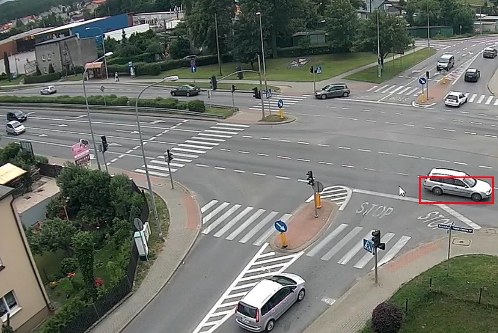
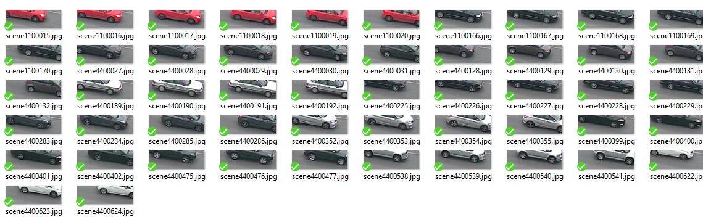
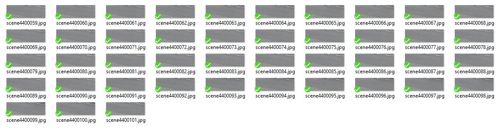
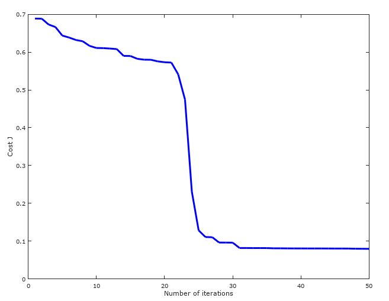

# Vehicles Counter
This Octave/Matlab script first learns how to recognize cars using neural networks then detects and counts them on live stream.

* Classification method: neural network with 1 hidden layer
* Optimization : Backpropagation

## Note
- *Written only for educational purposes*
- *Intentionally written in pure Matlab language, using only elementary arithmetic operations:*

## Input (snapshot)

## 'Cars'  samples

## 'Not cars' training samples

## Run
### Learn (optional)
* collect some training samples using [bin/collectSamples.bat](bin/collectSamples.bat)
* then put them to the respective directories under datasource/train/
* run [learn.m](learn.m) script in Matlab/Octave

#### Training efficiency

### Test (optional)
* collect some test samples using [bin/collectSamples.bat](bin/collectSamples.bat)
* then put them to the respective directories under datasource/test/
* run [check.m](check.m) script

### Detect
* open live stream using [bin/startStream.bat](bin/startStream.bat) 
* run [detect.m](detect.m) script

## Requirements
* [VLC](http://www.videolan.org)
* [Octave](https://www.gnu.org/software/octave)